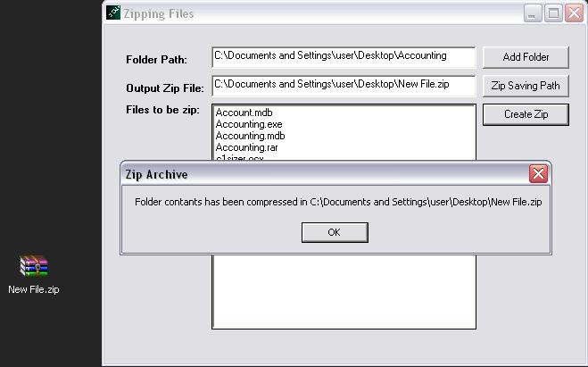



## Adding files in a folder to a Zip archive

### Description

How to add files of a folder to zip archive. Here I used zlib.dll(data compression library) and class library. very usefull for to give compression utility to your project. zlib.dll can download from: http://www.developerssourcecode.com/dsc/download_file.asp?intCodeID=152

Thanks

Shyam Singh Chandel
 
### More Info
 

             |
---                |---
**Submitted On**   |2009-08-08 11:33:30
**By**             |[ Shyam Singh Chandel](https://github.com/Planet-Source-Code/PSCIndex/blob/master/ByAuthor/shyam-singh-chandel.md)
**Level**          |Advanced
**User Rating**    |5.0 (15 globes from 3 users)
**Compatibility**  |VB 6\.0
**Category**       |[Libraries](https://github.com/Planet-Source-Code/PSCIndex/blob/master/ByCategory/libraries__1-49.md)
**World**          |[Visual Basic](https://github.com/Planet-Source-Code/PSCIndex/blob/master/ByWorld/visual-basic.md)
**Archive File**   |[Adding\_fil215948882009\.zip](https://github.com/Planet-Source-Code/shyam-singh-chandel-adding-files-in-a-folder-to-a-zip-archive__1-72342/archive/master.zip)

